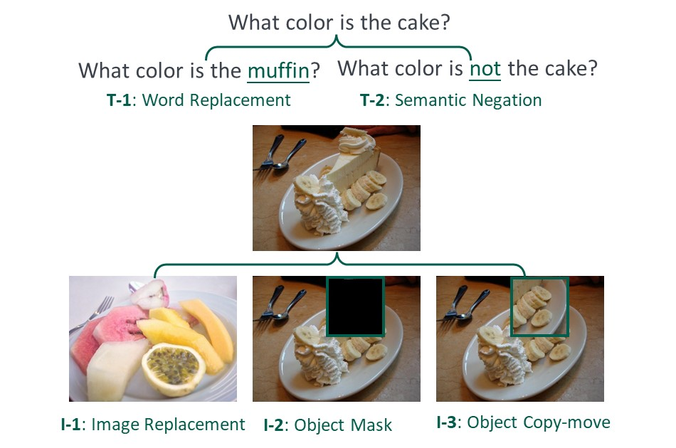
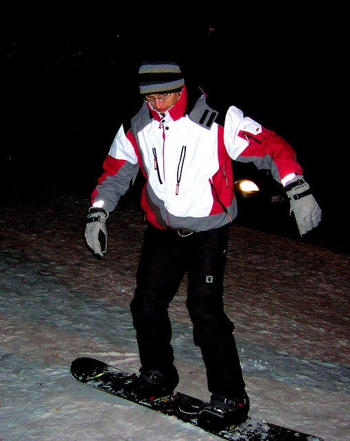

# UNK-VQA: Unanswerable Visual Question Answering
### A VQA dataset that includes unanswerable questions.
#### Code contribution: Fangkai Jiao (90%) and Yangyang Guo (10%).

The dataset is released at the [google link](https://drive.google.com/drive/folders/18Uapv6smzcWKmnE5tHWo3hxdl60qrbP3?usp=sharing).

### Dataset Structure
The dataset is structured as follows:
```
- images-train
    - COCO-*.jpg
    - ...
- images-val
    - COCO-*.jpg
    - ...
- annt_train.json
- annt_val.json
- annt_test.json
```

### Perturbation Types
There are 5 perturbation types in our dataset, and a short illustration is as follows:
<div style="text-align:center">
  
</div>

### Annotation Json File Illustration
In specific, each ```json``` file shares a similar structure (We show one example of the annotation below):
```json
{
    "answer_map": {
        "1": "I don't know (e.g., beyond my knowledge)",
        "2": "Not sure (e.g., multiple answers)",
        "3": "I cannot answer (e.g., difficult question)"
    },
    "reason_map": {
        "1": "It has multiple plausible answers",
        "2": "It is difficult to understand",
        "3": "The image lacks important concepts/information",
        "4": "It requires higher-level knowledge to answer"
    },
    "alter_type_map": {
        "T-1": "word replacement",
        "T-2": "semantic negation",
        "I-1": "image replacement",
        "I-2": "image mask",
        "I-3": "image copy and move"
    }
    "annotation": [
        {
            "question_id": 68248,
            "question": "What is the man wearing on his lips?",
            "image_name": "COCO_val2014_000000549683.jpg",
            "answerability": {
                "binary": true,
                "other": {
                    "answer": "nothing",
                    "options": {
                        "orig": "glasses",
                        "baseline": "nothing",
                        "random": "camera"
                    }
                }
            },
            "alter_type": "T-1",
            "misc": {
                "question_id_origin": 549683002,
                "image_name_origin": "COCO_val2014_000000549683.jpg",
                "answer_origin": "glasses"
            }
        },
    ]
}

```


### Acknowledgement

Please kindly ackonwledge the paper if you use the data:
```python
@misc{unk-vqa,
      title={Unanswerable Visual Question Answering}, 
      author={Yanyang Guo and Fangkai Jiao and Zhiqi Shen and Liqiang Nie and Mohan Kankanhalli},
      year={2023},
      eprint={2310.10942},
}
```